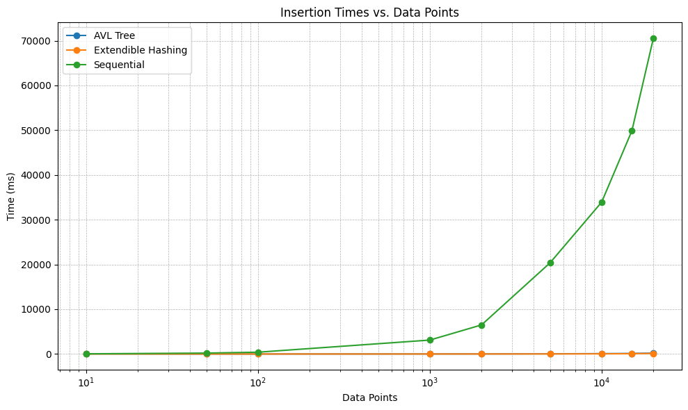

# Proyecto 1: Organización ed Archivos (Data Fusion DB)

## Introducción

El presente proyecto busca aplicar algoritmos de almacenamiento de archivos físicos y acceso concurrente.
Con la creación y manipulación de un dataset específico utilizando técnicas de organización de archivos.

### Objetivos
1. **Exploración de estrategias**:
    - Estudiar particularidades de archivos AVL, B+ y Extendible Hashing.
    - Identificar las ventajas y desventajas de cada estrategia de org. de archivos.
    - Analizar el rendimiento computacional con la implementación.

2. **Implementación de funciones básicas**:
    - Desarrollar algoritmos de inserción, búsqueda y eliminación para cada método de organización.
    - Comprender la interacción entre usuarios y servidores al crear GUI para la manipulación de bases de datos.

### Resultados esperados

1. **Reducción de Acceso a Memoria Secundaria**:
    - Minimizar lecturas extensas en RAM al acceder a través de índices directamente a los datos significativos  .

2. **Mejora en la Velocidad de Acceso**:
    - Las consultas y búsquedas se ejecutarán más rápidamente al utilizar índices para localizar rápidamente los datos pertinentes en lugar de recorrer toda la base de datos.

3. **Optimización del Tiempo de Procesamiento**:
    - Operaciones como inserciones, actualizaciones y eliminaciones se realizarán de manera más eficiente al utilizar índices para localizar registros y realizar modificaciones.

4. **Mejora del Rendimiento General**:
    - La indexación mejora el rendimiento y la eficiencia del sistema de gestión de bases de datos, lo que permite manejar cargas de trabajo más grandes y proporcionar una experiencia de usuario más rápida y fluida.

### Técnicas de indexación

Las técnicas usadas para este proyecto son las siguientes:

- [B+ Tree]
- [Extendible Hashing]
- [AVL]
- [Sequential]
### Implementación de funciones

Para cada técnica, se implementó las siguientes funciones:

- vector<Registro> search(T key)
- vector<Registro> rangeSearch(T begin-key, T end-key)
- bool add(Registro registro)
- bool remove(T key)

### DataSet1
Desarrollamos el proyecto con el dataset [Google Playstore](https://www.kaggle.com/datasets/lava18/google-play-store-apps). Esta elección fue debida a los siguientes factores:

- **Complejidad de los datos**: ofrece una amplia variedad de información relacionada con aplicaciones, como el nombre de la aplicación, el ID, la categoría, el número de instalaciones, el precio, y calificaciones. Estos datos ofrecen un gran desafío para las pruebas y permiten explorar diferentes tipos de consultas basadas en el rendimiento y la estructura.

- **Tamaño adecuado**: ontiene un número significativo de registros, lo que es adecuado para pruebas exhaustivas y evaluaciones de rendimiento de las técnicas de organización de archivos. Su tamaño equilibrado nos permite trabajar con datos suficientes sin ser tan grande como para hacer el proyecto inviable.

- **Relaciones entre datos**: Permite explorar relaciones entre (-----), lo que es útil para entender las estructuras de datos.

- **Versatilidad de consultas**: Con precio, categorías, código de aplicación, calificación o instalaciones, se pueden realizar diversas consultas para probar las funciones implementadas en las técnicas de organización.

```c++
struct AppRecord {
    char App_name[100];
    char App_id[100];
    char category[50];
    double rating;
    double rating_count;
    char installs[100];
    double minimum_installs;
    double maximum_installs;
    bool free;
    double price;
    char currency[10];
    char size[50];
    int anime_id = 0;
    double key = 0;         
};
```

|       Campo        |         Descripción          |
|:------------------:|:----------------------------:|
|   ```app_name```   |   Nombre de la aplicación    |
|    ```app_id```    |  ID único de la aplicación   |
|   ```category```   | Categoría a la que pertenece |
|    ```rating```    |    Calificación promedio     |
| ```rating_count``` |   Número de calificaciones   |
| ```min_installs``` |    Instalaciones mínimas     |
| ```max_installs``` |    Instalaciones máximas     |
|   ```is_free```    |  Indica si es gratuita o no  |
|    ```price```     |   Precio de la aplicación    |
|   ```currency```   |      Moneda del precio       |
|    ```size ```     |   Tamaño de la aplicación    |

### DataSet2
Desarrollamos el proyecto con un 2do dataset  [YouTube Stats](https://www.kaggle.com/datasets/datasnaek/youtube-new)  extraído de Kaggle pero limpiado y guardado como un nuevo csv posteriormente, denominado : "YTstats2.csv" . Esta elección fue debida a los siguientes factores:

- **Complejidad de los datos**: Este dataset ofrece una amplia variedad de información relacionada con videos de YouTube, como el título del video, el nombre del canal, vistas, likes, dislikes, y cantidad de comentarios. Estos datos permiten realizar pruebas exhaustivas y explorar diferentes tipos de consultas basadas en el rendimiento y la estructura de los registros.

- **Tamaño adecuado**: El dataset contiene un número significativo de registros, lo que es adecuado para realizar pruebas exhaustivas y evaluar el rendimiento de las técnicas de organización de archivos. Su tamaño es equilibrado, permitiendo trabajar con datos suficientes sin ser demasiado grande para dificultar el proyecto.

- **Relaciones entre datos**: Permite explorar relaciones entre popularidad de los videos (vistas, likes, dislikes) y la interacción de los usuarios (cantidad de comentarios). Esto es útil para entender cómo los diferentes factores afectan la relevancia de un video en la plataforma y para optimizar las consultas de rendimiento.

- **Versatilidad de consultas**: Con datos como el título del video, nombre del canal, vistas, likes, dislikes y cantidad de comentarios, se pueden realizar diversas consultas para probar las funciones implementadas en las técnicas de organización de archivos.

```c++
struct VideoRecord {
    char key[100];             
    char title[200];
    char channel_title[100];
    long long views;   
    long long likes;         
    long long dislikes;    
    long long comment_count; 
```


|        Campo        |          Descripción           |
|:-------------------:|:-----------------------------:|
|     ```key```       |  ID único del video           |
|    ```title```      |  Título del video             |
| ```channel_title``` |  Nombre del canal             |
|    ```views```      |  Número de vistas del video   |
|    ```likes```      |  Número de likes              |
|  ```dislikes```     |  Número de dislikes           |
| ```comment_count``` |  Cantidad de comentarios      |

## Técnicas Utilizadas
### AVL File
#### Insert
##### Descripción

1. **Verificación de Existencia del Registro**:
    - Se verifica si el registro ya existe en el archivo. Si el registro existe, se muestra un mensaje de error y se cierra el archivo:
      ```cpp
      if (find(record.key) != nullptr) {
          cerr << "El registro ya existe en el archivo." << endl;
          return false;
      }
      ```

2. **Inserción del Registro**:
    - Si la posición del nodo es `-1`, se crea un nuevo nodo al final del archivo:
      ```cpp
      if (position == -1) {
          Node newNode(record);
          writeToEndOfFile(newNode);
      }
      ```

3. **Inserción en un Nodo Existente**:
    - Si hay un nodo en la posición indicada, se lee el nodo actual:
      ```cpp
      Node currentNode = readFromFile(position);
      ```
    - Se decide si insertar a la izquierda o a la derecha del nodo actual:
      ```cpp
       if (record.key < currentNode.key) {
          currentNode.left = insertLeft(currentNode, record);
      } else {
          currentNode.right = insertRight(currentNode, record);
      }
      ```
    - Se actualizan los valores de `left` y `right` del nodo y se reescriben en el archivo:
      ```cpp
       updateNodeInFile(position, currentNode);
      ```

4. **Actualización y Balanceo del Árbol AVL**:
    - Se actualiza la altura del nodo y se balancea el árbol:
      ```cpp
      currentNode.height = 1 + max(getHeight(currentNode.left), getHeight(currentNode.right));
      currentNode = balance(currentNode);
      ```
    - Se escribe el nodo actualizado en el archivo:
      ```cpp
       writeToFile(currentNode);
      ```
#### Consideraciones
1. **Balance del Árbol**:
   - El árbol AVL mantiene el equilibrio tras cada operación de inserción y eliminación. Esto garantiza que la profundidad del árbol se mantenga en \(O(\log n)\), lo que hace que las búsquedas, inserciones y eliminaciones sean eficientes.
   - Sin embargo, mantener el equilibrio requiere actualizaciones adicionales después de cada inserción y eliminación, lo que añade cierta sobrecarga computacional.

2. **Uso en Aplicaciones**:
   - El árbol AVL es ideal para situaciones donde se realizan muchas consultas de búsqueda y es importante que estas consultas sean rápidas. Sin embargo, su uso en escenarios donde predominan las inserciones y eliminaciones puede no ser óptimo debido al reequilibrado.

3. **Complejidad Espacial**:
   - Cada nodo debe almacenar información adicional como el factor de balance y la altura, lo que puede aumentar ligeramente el consumo de memoria en comparación con otros árboles binarios.


### B+ Tree

#### Función Insert

1. **Verificación de Espacio en el Nodo**:
   - Antes de insertar un nuevo registro, se verifica si el nodo tiene espacio disponible. Si no tiene espacio, se divide el nodo:
     ```cpp
     if (node.isFull()) {
         splitNode(node);
     }
     ```

2. **Inserción del Registro**:
   - Si el nodo tiene espacio, se inserta el registro en el nodo:
     ```cpp
     node.addRecord(record);
     ```

3. **Propagación de la División**:
   - Si el nodo se divide, se propaga la división hacia el nodo padre para mantener el equilibrio del árbol:
     ```cpp
     propagateSplit(parentNode, node);
     ```

4. **Actualización de Punteros**:
   - Tras la inserción, se actualizan los punteros a los nodos hijo para mantener la estructura del B+ Tree:
     ```cpp
     updatePointersAfterInsert(node);
     ```

#### Función Search

1. **Búsqueda por Clave**:
   - Se realiza una búsqueda en el árbol B+ utilizando una clave específica. Si la clave se encuentra, se devuelve el registro correspondiente:
     ```cpp
     auto *it = tree.search(key);
     if(it == nullptr)
         cout << key << " not found..." << endl;
     else
         cout << *it << endl;
     ```

#### Función RangeSearch

1. **Búsqueda en un Rango de Claves**:
   - La función `range_search()` realiza una búsqueda de todos los registros que se encuentran entre dos claves especificadas:
     ```cpp
     vector<Record<int>> ans = tree.range_search(20, 30);
     ```

2. **Devolución de Resultados**:
   - Los registros que se encuentran dentro del rango son devueltos como un vector de registros:
     ```cpp
     for(auto val : ans)
         cout << val << endl;
     ```

#### Función PrintAll

1. **Mostrar Todos los Nodos**:
   - La función `print_all()` imprime la información de todos los nodos índice y nodos de datos en el B+ Tree:
     ```cpp
     tree.print_all();
     ```

2. **Visualización de Nodos**:
   - Se visualizan tanto los nodos índice como los nodos de datos, junto con su contenido, para propósitos de depuración y visualización:
     ```cpp
     cout << "-------------INDEX NODES BEGIN ---------------------------" << endl;
     for (int i = 0; i < index_total; ++i) {
         index_node = read_index_node_in_pos(file_index, i);
         cout << "-------index Node number [" << i << "]-----------" << endl;
         index_node.showdata();
         cout << "---------------------------------------------" << endl;
     }
     ```

#### Consideraciones
1. **Optimización para Almacenamiento en Disco**:
   - El B+ Tree está diseñado para minimizar las operaciones de entrada/salida en disco. Almacena todos los registros en las hojas del árbol, lo que permite que las búsquedas en los nodos índice sean más rápidas.
   - Este tipo de árbol es especialmente útil para bases de datos y sistemas de archivos donde se realizan muchas operaciones de lectura/escritura.

2. **Rendimiento de Búsqueda y Actualización**:
   - Las búsquedas en un B+ Tree son rápidas debido a que el árbol está siempre balanceado y la profundidad es baja. Las operaciones de inserción y eliminación también son eficientes, pero pueden implicar la división y fusión de nodos, lo que genera sobrecarga.

3. **Almacenamiento de Múltiples Registros en las Hojas**:
   - En un B+ Tree, las hojas contienen punteros a los registros, lo que hace que la estructura sea eficiente en términos de almacenamiento y permite realizar búsquedas por rango de manera eficiente. Este comportamiento es útil en aplicaciones donde se requieren consultas por rango de claves.


### Extendible Hashing

#### Función Insert

1. **Cálculo del Hash**:
   - Para insertar un nuevo registro, primero se calcula el valor del hash utilizando la clave proporcionada:
     ```cpp
     int hashValue = hash(record.key);
     ```

2. **Verificación del Bucket**:
   - Se verifica si el bucket correspondiente al valor del hash tiene espacio suficiente para el nuevo registro:
     ```cpp
     if (bucket.isFull()) {
         expandBucket(bucket);
     }
     ```

3. **Inserción del Registro**:
   - Si el bucket tiene espacio, se inserta el registro:
     ```cpp
     bucket.addRecord(record);
     ```

4. **Expansión de la Tabla de Hash**:
   - Si el bucket está lleno, la tabla de hash se expande para acomodar el nuevo registro:
     ```cpp
     if (directory.isFull()) {
         expandDirectory();
     }
     ```

#### Función Remove

1. **Buscar el Bucket**:
   - Primero, se busca el bucket correspondiente a la clave utilizando el hash de la clave:
     ```cpp
     fstream file(this->fileName, ios::binary | ios::in | ios::out);
     file.seekg(this->directory[index], ios::beg);
     ```

2. **Eliminar el Registro**:
   - Si el registro se encuentra en el bucket, se elimina y se reordenan los registros restantes:
     ```cpp
     for (int i = 0; i < bucket.size; ++i) {
         if (bucket.records[i] == key) {
             for (int j = i; j < bucket.size - 1; ++j) {
                 bucket.records[j] = bucket.records[j + 1];
             }
             bucket.size--;
             break;
         }
     }
     ```

3. **Actualización del Bucket**:
   - Después de eliminar el registro, se actualiza el bucket en el archivo de datos:
     ```cpp
     fstream file_data(this->fileName, ios::binary | ios::in | ios::out);
     file_data.seekp(this->directory[index] + sizeof(int), ios::beg);
     file_data.write((char *) &bucket, sizeof(bucket));
     file_data.close();
     ```

4. **Actualización del Head**:
   - Si el bucket eliminado no es el primer bucket en la lista, se actualiza el head para apuntar al bucket correcto:
     ```cpp
     if (head != -1) {
         fstream file_head(this->fileName, ios::binary | ios::in | ios::out);
         file_head.seekp(this->directory[index], ios::beg);
         int posreal = pos + sizeof(int);
         file_head.write((char *) &posreal, sizeof(posreal));
         file_head.close();
     }
     ```

#### Función DisplayDirectory

1. **Mostrar el Directorio**:
   - Se imprimen todas las posiciones del directorio que contienen los punteros a los buckets:
     ```cpp
     for (int i = 0; i < this->directory.size(); ++i) {
         cout << "directory[" << i << "] -> " << this->directory[i] << endl;
     }
     ```

2. **Mostrar la Relación entre Buckets**:
   - También se muestran los buckets vinculados a cada entrada del directorio:
     ```cpp
     cout << "Displaying directory" << endl;
     for (int i = 0; i < this->directory.size(); ++i) {
         cout << "directory[" << i << "] -> " << this->directory[i] << endl;
     }
     ```

#### Consideraciones
1. **Expansión Dinámica**:
   - Una de las principales ventajas del Hashing Extensible es su capacidad para expandir el tamaño de la tabla hash a medida que aumenta el número de elementos, sin necesidad de rehash completo de todos los elementos. Esto reduce la sobrecarga en comparación con otros métodos de hash.

2. **Coste de Expansión**:
   - Si bien el hashing extensible es eficiente en la mayoría de los casos, su rendimiento puede verse afectado durante las expansiones, ya que se requiere reconfigurar los punteros y posibles duplicaciones de directorios. Las expansiones frecuentes pueden generar sobrecarga si los datos crecen rápidamente.

3. **Claves No Ordenadas**:
   - Dado que las claves no se almacenan en orden (a diferencia de los árboles), el Hashing Extensible no es adecuado para consultas por rango. Este método es ideal para aplicaciones que requieren búsquedas rápidas por clave exacta, pero no es eficiente para operaciones que requieren un recorrido secuencial de los datos.

4. **Complejidad Espacial**:
   - La estructura puede consumir más memoria que una tabla de hash convencional si la tabla de directorio crece significativamente debido a las expansiones. Sin embargo, esta sobrecarga es compensada por el rendimiento en búsquedas exactas.


### Organización Secuencial

#### Función_Insert

1. **Conversión de Registro desde CSV**:
   - Al insertar un nuevo registro, primero se convierte una línea de un archivo CSV a un objeto `Record`:
     ```cpp
     if (record.fromCSV(line)) {
         file.seekp(0, ios::end);
         file.write((char *)&record, sizeof(Record));
     }
     ```

2. **Escribir el Registro**:
   - El registro convertido se escribe en el archivo principal binario (`main_file`):
     ```cpp
     file.write((char *)&record, sizeof(Record));
     ```

3. **Inserción de un Nuevo Registro en el Archivo**:
   - Se pueden agregar nuevos registros al archivo de inserciones, y estos son luego fusionados en el archivo principal:
     ```cpp
     void insert(int key) {
         Record record(key);
         fstream file(insert_file, ios::in | ios::out | ios::binary);
         file.seekp(0, ios::end);
         file.write((char *)&record, sizeof(Record));
         file.close();
     }
     ```

#### Función Search

1. **Búsqueda de Registro por Clave**:
   - Se realiza una búsqueda secuencial en el archivo para encontrar la posición de un registro con una clave específica:
     ```cpp
     int pos = search(key);
     ```

2. **Lectura del Registro**:
   - Una vez que se encuentra la posición, se lee el registro desde el archivo:
     ```cpp
     Record record = read_record(pos);
     ```

3. **Visualización del Registro**:
   - El registro recuperado es mostrado en la consola:
     ```cpp
     record.show();
     ```

#### Función Remove

1. **Buscar el Registro para Eliminar**:
   - Primero se busca la posición del registro que se desea eliminar:
     ```cpp
     int pos = search(key);
     ```

2. **Marcar como Eliminado**:
   - Si el registro es encontrado, se marca como eliminado modificando el campo `is_removed` a `true`:
     ```cpp
     record.is_removed = true;
     ```

3. **Escribir el Registro Actualizado**:
   - Se escribe el registro modificado en el archivo en su posición original:
     ```cpp
     write_record(record, pos);
     ```

#### Función PrintAll

1. **Imprimir Todos los Registros**:
   - La función `print_all()` lee todos los registros en el archivo y los muestra si no están marcados como eliminados:
     ```cpp
     while (file.read((char *)&record, sizeof(Record))) {
         if (record.is_removed == false)
             record.show();
     }
     ```

2. **Mostrar el Tamaño del Archivo**:
   - Al final, se muestra el tamaño del archivo, que corresponde al número de registros:
     ```cpp
     cout << "size: " << size << endl;
     ```


#### Consideraciones
1. **Eficiencia en Búsquedas Secuenciales**:
   - La organización secuencial es adecuada cuando se accede a registros de manera ordenada o por rango. Las consultas secuenciales son más rápidas que en estructuras no ordenadas, ya que los registros están almacenados en orden.

2. **Inserción Costosa**:
   - La principal desventaja de la organización secuencial es la inserción, ya que al agregar nuevos registros es posible que sea necesario reorganizar y desplazar múltiples registros para mantener el orden. Esto puede resultar en una gran sobrecarga si las inserciones son frecuentes.

3. **Eliminaciones Lógicas**:
   - En lugar de eliminar físicamente un registro, el archivo secuencial marca el registro como "eliminado". Esto puede causar que el archivo crezca con registros innecesarios, lo que impacta el rendimiento a largo plazo si no se realiza una compactación periódica del archivo.

4. **Reordenamiento de Datos**:
   - Debido a la naturaleza secuencial, se debe realizar una reordenación de los datos tras la inserción o eliminación de registros. Esto añade complejidad computacional, especialmente si el archivo es muy grande.


# SQL Parser

### **ParserSQL (`parserSQL.h`)**

1. **Constructor del Parser**:
   - El constructor `Parser::Parser` acepta un puntero a un objeto `Scanner` y una cadena que representa el tipo de estructura de datos (como `AVLFile`, `ExtendibleHashing`, `SequentialFile`, etc.). Dependiendo del valor de la cadena, se crea una instancia de la estructura de datos correspondiente usando la fábrica `DataStructureFactory`. Luego, el constructor inicializa el puntero `scanner` y llama a `nextToken()` para obtener el primer token.

   ```cpp
   template<class TK>
   Parser<TK>::Parser(Scanner *scanner, const char *estructura) {
       this->scanner = scanner;
       if (strcmp(estructura, "avlFilePlaystore") == 0){
           this->instance = DataStructureFactory::createAVL<TK>("playstore1.dat");
           strcpy(fileStructure, "avlFilePlaystore");
       }
       else if (strcmp(estructura, "extendibleFileYoutube") == 0){
           this->instance = DataStructureFactory::createExtendible<TK>("youtube2.dat","dir1.dat");
           strcpy(fileStructure, "extendibleFileYoutube");
       }
       currentToken = scanner->nextToken();
   }
   ```

2. **Método `parse()`**:
   - Este método es el núcleo del análisis. Se encarga de recorrer los tokens hasta alcanzar el final del archivo, representado por `Token::END`. En cada iteración, se llama a `parseStatement()` para procesar cada instrucción SQL, y se espera que cada declaración termine con un `Token::SEMICOLON`. Si no es así, se genera un error.
    ```cpp
    template<class TK>
    void Parser<TK>::parse() {
    while (currentToken->type != Token::END) {
        parseStatement();
        if (currentToken->type == Token::SEMICOLON) {
            currentToken = scanner->nextToken();
        } else if (currentToken->type != Token::END) {
            error("Expected token: SEMICOLON but got: " +     string(Token::token_names[currentToken->type]));
        }
    }
    ```

3. **Método `parseStatement()`**:
   - Este método determina el tipo de instrucción SQL (como `CREATE`, `SELECT`, `INSERT` o `DELETE`) basado en el token actual. Una vez identificado el tipo de instrucción, se delega la tarea de análisis a un método específico. Si el token no coincide con una declaración esperada, se lanza un error.

   ```cpp
    template<class TK>
    void Parser<TK>::parseStatement() {
    if (currentToken->type == Token::CREATE) {
        parseCreateTable();
    } else if (currentToken->type == Token::SELECT) {
        parseSelect();
    } else if (currentToken->type == Token::INSERT) {
        parseInsert();
    } else if (currentToken->type == Token::DELETE) {
        parseDelete();
    } else {
        error("Unexpected token: " + string(Token::token_names[currentToken->type]));
    }
}```


4. **Declaraciones**:
   - Métodos como `parseCreateTable()`, `parseSelect()`, `parseInsert()`, y `parseDelete()` se encargan de desglosar y analizar declaraciones de SQL. Cada uno de estos métodos utiliza `expect()` para asegurarse de que los tokens sigan la estructura esperada y realizan las operaciones.
   - `parseCreateTable()`: Analiza la declaración `CREATE TABLE`, creando una nueva tabla en la estructura de datos correspondiente e insertando registros.
   -`parseSelect()`: Analiza la consulta `SELECT` y ejecuta una búsqueda en la estructura de datos basada en condiciones.
   -`parseInsert()`: Procesa una declaración `INSERT INTO`, leyendo los valores a insertar y agregándolos a la estructura de datos.
  -`parseDelete()`: Elimina registros en función de una condición `WHERE`.
```cpp
template<class TK>
void Parser<TK>::parseCreateTable() {
    cout << "---- Parsing CREATE TABLE" << endl;
    expect(Token::CREATE);
    expect(Token::TABLE);
    string tableName = expect(Token::ID)->lexema;
    expect(Token::FROM);
    expect(Token::FILE);
    string fileName = expect(Token::VALUE)->lexema;
    expect(Token::USING);
    expect(Token::INDEX);
    Token* indexType = expectOneOf({Token::AVL, Token::ISAM, Token::EXTENDIBLE, Token::SEQUENTIAL});
    
    Table table = {tableName, fileName, Token::token_names[indexType->type]};
    tables.push_back(table);
    vector<Record<TK>> records = readCSV<TK>("../" + fileName);
    this->records = records;

    if (indexType->type == Token::AVL) {
        if (tableName == "Playstore") {
            for (int i = 0; i < 10000; ++i) {
                instance->insert(records[i]);
            }
        }
    }
}

```

5. **Métodos de Utilidad**:
   - `parseCondition()` y `parseValues()` son dos métodos para analizar condiciones y listas de valores. Estos métodos son esenciales en la implementación de sentencias SQL como `SELECT` e `INSERT`.

```cpp
template<class TK>
Condition Parser<TK>::parseCondition() {
    auto token = expect(Token::ID);
    string field = token->lexema;
    Token* opToken = currentToken;

    if (opToken->type == Token::EQUAL) {
        expect(Token::EQUAL);
        string value = expect(Token::VALUE)->lexema;
        return {field, "=", value, ""};
    } else if (opToken->type == Token::BETWEEN) {
        expect(Token::BETWEEN);
        string value1 = expect(Token::VALUE)->lexema;
        expect(Token::AND);
        string value2 = expect(Token::VALUE)->lexema;
        return {field, "between", value1, value2};
    }
    return {};
}
```

6. **Auxiliares**:
   - Las funciones `expect()` y `expectOneOf()` permiten validar que el token actual coincida con lo que el parser espera encontrar en esa pos . Si el token no es el esperado, se genera un error, lo que ayuda a garantizar que la sintáxis sea correcta antes de proceder.

```cpp
template<class TK>
Token* Parser<TK>::expect(Token::Type type) {
    if (currentToken->type == type) {
        Token* token = currentToken;
        currentToken = scanner->nextToken();
        return token;
    } else {
        error("Expected token: " + string(Token::token_names[type]) + " but got: " + string(Token::token_names[currentToken->type]));
        return nullptr;
    }
}

template<class TK>
Token* Parser<TK>::expectOneOf(const initializer_list<Token::Type> &types) {
    for (Token::Type type : types) {
        if (currentToken->type == type) {
            Token* token = currentToken;
            currentToken = scanner->nextToken();
            return token;
        }
    }
    error("Expected one of the following tokens.");
    return nullptr;
}

```

### **TokenSQL (tokensSQL.h)**

1. **Clase `Token`:**
   - Esta clase representa un token, con dos atributos fundamentales: el tipo (`Type`) y el lexema (`lexema`). Además, incluye un conjunto de nombres descriptivos para cada tipo de token y sobrecarga operadores como `<<` para facilitar su impresión y depuración.
```cpp
class Token {
public:
    Type type;
    string lexema;
};
```

2. **Clase `ReservedWords`:**
   - Implementa una tabla de hash que asocia las palabras reservadas del lenguaje SQL con sus correspondientes tipos de token.Esto permite al parser diferenciar fácilmente entre identificadores de usuario y palabras reservadas del lenguaje SQL.
```cpp
class ReservedWords {
public:
    static unordered_map<string, Token::Type> reservedWords;
};
```
3. **Clase `Scanner`:**
   - El `Scanner` es responsable de tomar la entrada en formato de texto y dividirla en tokens. Aplica reglas gramaticales específicas para identificar diferentes componentes del lenguaje SQL y clasificar los tokens. El scanner es esencial para preparar el conjunto de tokens que serán interpretados por el parser.
```cpp   
class Scanner {
public:
    Token* nextToken();
};
```
El sistema implementado consta de un scanner que analiza el código de entrada y genera una secuencia de tokens. Luego, el parser se encarga de interpretar esos tokens y ejecutar las instrucciones SQL correspondientes. Se procesan declaraciones como `CREATE`, `SELECT`, `INSERT` y `DELETE`, asegurando que la sintaxis SQL sea correcta y que las

## Obtener módulo de Python a partir de C++
En la carpeta binding, hacer `git clone https://github.com/pybind/pybind11.git`. Crear directorio build y ejecutar el comando `cmake ..` estando dentro. Ejecutar `make` y el archivo file_organization... (el nombre dependerá de la computadora) se creará. Llevar este módulo a la misma carpeta donde se encuentra `app.py` y ya se puede importar como módulo de python.

# Benchmark de Inserciones en Estructuras de Datos

Este benchmark compara el tiempo de inserción de tres estructuras de datos: Árboles AVL, Hashing Extensible y Archivos Secuenciales. Las pruebas se realizaron en dos conjuntos de datos: **YouTube** y **Google Play Store**. El objetivo es ver el rendimiento de inserciones con diferentes puntos de data y analizar la escala en el tiempo de cada inserciónn por estructura 
## Dataset: YouTube

La gráfica muestra los tiempos de inserción en milisegundos, utilizando tres estructuras de datos (AVL), (Extendible Hashing) y (Sequential); exlpicados previamente en el informe:

### Gráfica: Tiempos de Inserción vs. Puntos de Datos (YouTube)



### Conclusionesn de la gráfica:
- El **Árbol AVL** evidencia un comportamiento de crecimiento notable proporcional al aumenta de los puntos de datos, debido a la necesidad de re-balancear el árbol.
- El **Extendible Hashing** tiene un comportamiento constante, con tiempos de inserción muy bajos, lo que lo hace ideal para grandes cantidades de datos.
- La **Estructura Sequential** comienza a relentizarse a medida que se incrementa el número de datos, alcanzando tiempos de inserción elevados en conjuntos de datos grandes.

---

## Dataset: Google Play Store

La siguiente gráfica muestra los tiempos de inserción para el conjunto de datos de **Google Play Store** con las mismas estructuras de datos mencionadas anteriormente.

### Gráfica: Tiempos de Inserción vs. Puntos de Datos (Google Play Store)


### Observaciones:
- De manera similar al conjunto de datos de YouTube, el **Árbol AVL** muestra un incremento considerable en el tiempo de inserción a medida que crecen los puntos de datos.
- El **Hashing Extensible** continúa siendo muy eficiente, manteniendo tiempos de inserción constantes incluso con un número elevado de datos.
- La **Estructura Sequential** también muestra una desaceleración significativa cuando el tamaño de los datos es muy grande, siendo la estructura más ineficiente en este caso.

---

## Conclusiones:

- **AVL Tree** es útil para datos moderados, pero no escala bien cuando se manejan millones de registros debido al sobrecosto del balanceo del árbol.
- **Extendible Hashing** es la estructura de datos más eficiente para grandes cantidades de datos debido a su rendimiento constante en operaciones de inserción.
- **Sequential** es una opción adecuada solo para pequeños conjuntos de datos, ya que se vuelve extremadamente ineficiente cuando los datos crecen.

Este benchmark destaca la importancia de seleccionar la estructura de datos adecuada según el tamaño del conjunto de datos y los requisitos de rendimiento.


# Benchmark de Rango de Búsqueda en Estructuras de Datos

Este benchmark compara el tiempo de búsqueda por rango de tres estructuras de datos: Árboles AVL, Hashing Extensible y Archivos Secuenciales. Las pruebas se realizaron en 1 conjunto de datos: **YouTube** . El objetivo es ver el rendimiento de inserciones con diferentes puntos de data y analizar la escala en el tiempo de cada inserciónn por estructura 
## Dataset: YouTube


## Integrantes
|                    **Paolo Medrano Terán**                   |                          **Sebastián Chu**                          |                         **Fabricio Chavez**                          |                         **Andrea Coa**                         |                       **Jesús Ore Eguzquiza**                       |
|:---------------------------------------------------------------:|:-------------------------------------------------------------------:|:-------------------------------------------------------------------:|:------------------------------------------------------------------:|:-------------------------------------------------------------:|
| <a href="https://github.com/paolomedrano04" target="_blank">`github.com/paolomedrano04`</a> | <a href="https://github.com/ChuSebastian" target="_blank">`github.com/ChuSebastian`</a> | <a href="https://github.com/FabricioChavez" target="_blank">`github.com/FabricioChavez`</a> | <a href="https://github.com/Andrea-Coa" target="_blank">`github.com/Andrea-Coa`</a> | <a href="https://github.com/EgusquizaOreJesus" target="_blank">`github.com/EgusquizaOreJesus"`</a> |
